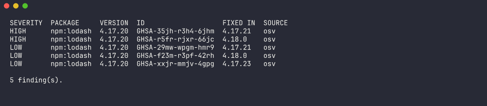
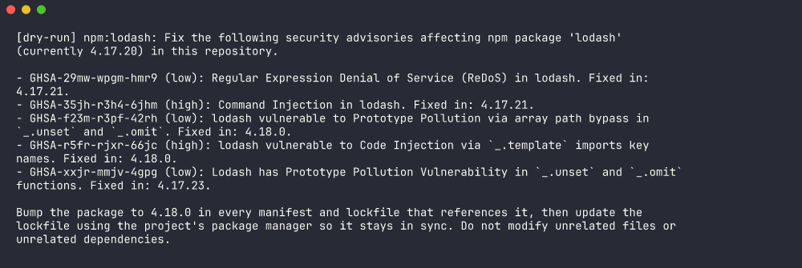
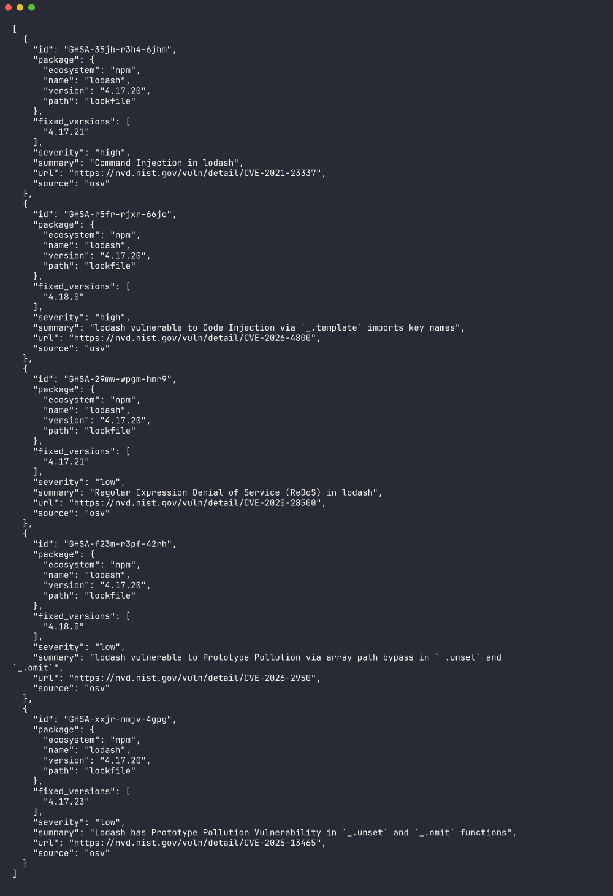
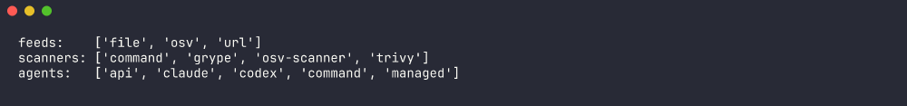
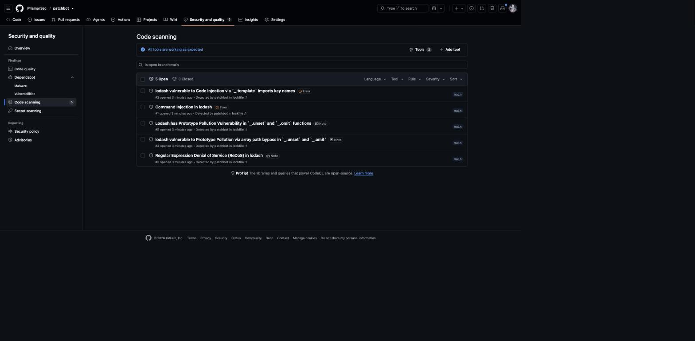
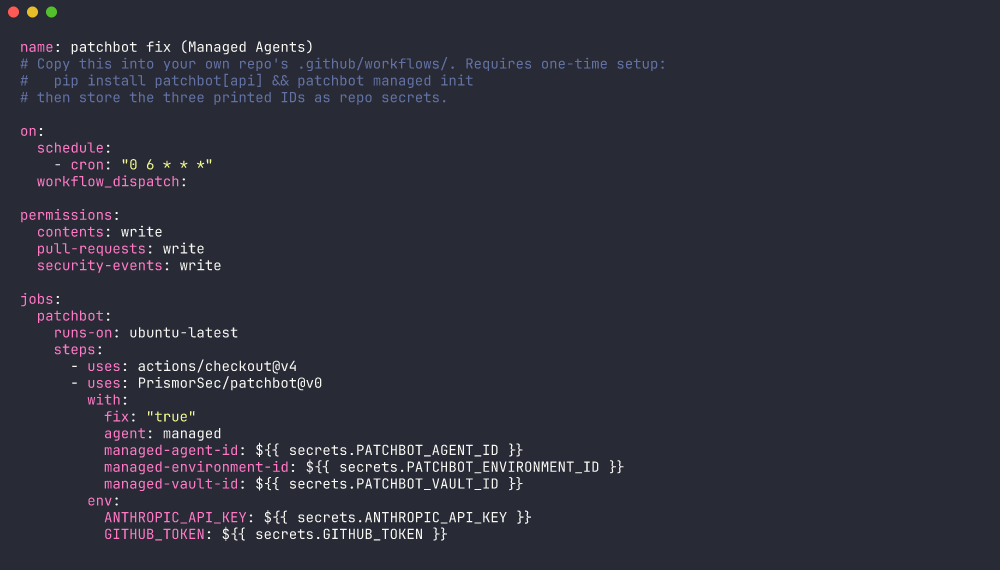
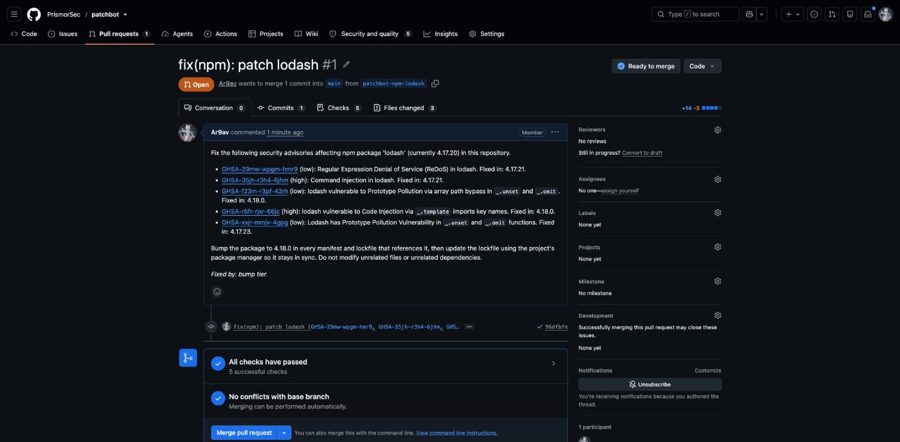

# patchbot

Bring-your-own-scanner, bring-your-own-feed vulnerability scanning — with a
coding agent opening the fix PR.



```
inventory ──► feeds (match pkg@ver) ──┐
                                      ├──► findings ──► report (table/json/sarif)
scanners (trivy/grype/osv-scanner/sarif/any cmd) ──┘        └──► fix (bump → verify → agent on failure → PR)
```

- **Inventory**: built-in npm/pnpm/yarn/pip/go/cargo manifest+lockfile parsers, plus any CycloneDX SBOM (`syft`, `cdxgen`, or your own).
- **Feeds**: OSV.dev by default. Bring your own threat feed as an OSV-schema JSON file or URL — no custom format to write.
- **Scanners**: bring your own scanner. Built-in wrappers for `trivy`, `grype`, `osv-scanner`, or point `command` at any tool that emits trivy/grype/osv-scanner/SARIF JSON.
- **Fix**: tries a deterministic version bump + lockfile regen first (no AI needed, most fixes are exactly this). Only when that fails — a breaking major bump, a failing test suite, a transitive dependency needing an override — does a coding agent get a turn, with the failure itself as its brief. A rescan gates every PR either way.

## Install

```
pip install patchbot
```

## 60-second quickstart

```
patchbot scan                          # table report, uses OSV by default
patchbot fix --dry-run                 # preview the fix plan, make no changes
patchbot fix --pr                      # bump/fix + open PRs (needs `gh` on PATH)
```



## Commands

| Command | Purpose |
|---|---|
| `patchbot scan [paths...]` | Inventory → feeds/scanners → report. Exits non-zero at `--fail-on` severity or worse. |
| `patchbot fix [paths...]` | Tiered fix loop: deterministic bump, then agent escalation on failure. `--dry-run` to preview, `--pr` to actually push + open PRs. |
| `patchbot plugins` | List every registered feed, scanner, and agent (builtin + entry-point plugins). |
| `patchbot managed init/deploy/list/pause/unpause` | One-time setup and scheduling for the Managed Agents fix backend — see below. |

```
$ patchbot scan --format json | head
```



```
$ patchbot plugins
```



## Config (`patchbot.toml`)

```toml
[inventory]
paths = ["."]
# sbom = "sbom.cdx.json"

[feeds.osv]
enabled = true

[feeds.internal]
type = "url"          # or "file" with `path = "..."`
url = "https://intel.example.com/osv-feed.json"

[scanners.trivy]
enabled = true

[scanners.mine]
type = "command"
cmd = "./scan.sh"
format = "sarif"       # or trivy | grype | osv-scanner

[report]
fail_on = "high"        # critical | high | medium | low | none
ignore = ["GHSA-xxxx-xxxx-xxxx"]

[fix]
agent = "claude"        # claude | codex | api | command | managed | none
model = "claude-opus-5" # optional, passed through to claude/codex/api/managed
max_prs = 5
test_cmd = "npm test"

# only for [fix] agent = "command":
# cmd = "aider --yes --message {prompt}"

# only for [fix] agent = "managed" (see "Claude Managed Agents" below):
[fix.managed]
agent_id = "agent_..."
environment_id = "env_..."
vault_id = "vlt_..."
```

CLI flags override the config file.

## How the fix loop decides what to do

For each vulnerable package, `patchbot fix`:

1. **Tries a deterministic bump** (`patchbot/bump.py`) — rewrite the pin in the manifest, regenerate the lockfile with the ecosystem's own tool (`npm install --package-lock-only`, `go mod tidy`, `cargo update`, ...). No agent call.
2. **Rescans and runs `test_cmd`** to verify the advisory is actually gone and nothing broke.
3. **Only on failure**, escalates to the configured agent — with the *failure* as the prompt ("bumped X to Y; tests still fail with: ...", or "the advisory still reproduces"), not the original vague task. Rescan + tests gate this too.
4. A diff-allowlist check rejects any agent change that touches CI config or dotfiles instead of the dependency surface.
5. On success: commit, and with `--pr`, push + `gh pr create` with the advisory table in the body.

`--agent none` disables the agent tier entirely (pure deterministic-bump mode, closest to Dependabot).

## Plugging in an AI model

Four backends for the agent tier, in increasing order of setup:

**`claude` / `codex`** — shells out to the Claude Code or Codex CLI already on PATH. Pass `--model` to pick a specific model. Simplest for local use.

**`api`** — no CLI at all. `pip install patchbot[api]` gets you the `anthropic` SDK; `patchbot fix --agent api` runs a small bash+write_file tool loop directly against the Messages API. Needs only `ANTHROPIC_API_KEY`. Good CI default when you don't want to install Node.

**`command`** — bring your own agent. Point `[fix] cmd` at anything that takes a prompt and edits files:

```toml
[fix]
agent = "command"
cmd = "aider --yes --message {prompt}"
```

`{prompt}`/`{model}` are substituted into the command; the prompt is also exported as `PATCHBOT_PROMPT` so you can avoid shell-quoting it.

**`managed`** — [Claude Managed Agents](https://platform.claude.com/docs/en/managed-agents/overview), the recommended CI backend. This is the one that actually solves "an LLM has a shell on my CI runner right next to my repo secrets": the agent runs in Anthropic's sandbox, not your runner, and your GitHub token never enters it — repo push goes through Anthropic's git proxy and PR creation goes through a vaulted GitHub MCP credential. patchbot's own rescan still runs host-side afterward; a session's self-reported success is never the fix gate.

One-time setup:

```
pip install patchbot[api]
patchbot managed init --github-mcp-token "$GITHUB_MCP_TOKEN"
```

prints three IDs — put them in `[fix.managed]` or as repo secrets (`PATCHBOT_AGENT_ID`/`_ENVIRONMENT_ID`/`_VAULT_ID`), then:

```
patchbot fix --agent managed --pr
```

## GitHub Actions

Scan-only, upload results to the Security tab:

```yaml
permissions:
  security-events: write
steps:
  - uses: actions/checkout@v4
  - uses: PrismorSec/patchbot@v0
    with:
      fail-on: high
```



Fix PRs with the `api` agent (no Node/npm install needed):

```yaml
permissions:
  contents: write
  pull-requests: write
  security-events: write
steps:
  - uses: actions/checkout@v4
  - uses: PrismorSec/patchbot@v0
    with:
      fix: "true"
      agent: api
    env:
      ANTHROPIC_API_KEY: ${{ secrets.ANTHROPIC_API_KEY }}
```

Fix PRs with Managed Agents (recommended — the agent never touches this runner):

```yaml
permissions:
  contents: write
  pull-requests: write
steps:
  - uses: actions/checkout@v4
  - uses: PrismorSec/patchbot@v0
    with:
      fix: "true"
      agent: managed
      managed-agent-id: ${{ secrets.PATCHBOT_AGENT_ID }}
      managed-environment-id: ${{ secrets.PATCHBOT_ENVIRONMENT_ID }}
      managed-vault-id: ${{ secrets.PATCHBOT_VAULT_ID }}
    env:
      ANTHROPIC_API_KEY: ${{ secrets.ANTHROPIC_API_KEY }}
      GITHUB_TOKEN: ${{ secrets.GITHUB_TOKEN }}
```

Weekly schedule against a private feed:

```yaml
on:
  schedule:
    - cron: "0 6 * * 1"
steps:
  - uses: actions/checkout@v4
  - uses: PrismorSec/patchbot@v0
    with:
      config: patchbot.toml   # holds [feeds.internal] url = ${{ secrets.FEED_URL }}
```

See [`action.yml`](./action.yml) for every input, and
[`.github/workflows/patchbot-fix-example.yml`](.github/workflows/patchbot-fix-example.yml)
for a full copy-paste workflow (rendered below).



A PR opened by `patchbot fix --pr`:



## Scheduled deployments (no CI at all)

`patchbot managed deploy` sets up a cron-scheduled Managed Agents session that
scans and fixes a list of repos on its own — no GitHub Actions workflow, no
runner, works against GitLab/Bitbucket too since nothing here is
Actions-specific:

```
patchbot managed deploy --repos owner/a,owner/b \
  --cron "0 6 * * *" --tz UTC \
  --agent-id agent_... --environment-id env_... --vault-id vlt_...
```

`patchbot managed list/pause/unpause` manage it afterward; `--run-now` fires
one session immediately to test before trusting the schedule. Note: cron
execution is jittered up to ~9 minutes and DST wall-clock edge cases can
skip or double-fire a 1–3AM local run — schedule outside that window, or use
UTC, if that matters.

## Bring your own scanner

Any command that emits trivy, grype, osv-scanner, or SARIF JSON on stdout works:

```toml
[scanners.custom]
type = "command"
cmd = "my-scanner --json"
format = "sarif"
```

`cmd` runs via the shell using your config, so only point it at commands you trust.

## Bring your own threat feed

Any URL or file serving OSV schema JSON (a bare array of vuln records, or
`{"vulns": [...]}`):

```toml
[feeds.mine]
type = "file"
path = "./our-advisories.json"
```

## Writing a plugin

Register a scanner, feed, or agent from your own pip package via entry points —
no fork of patchbot required:

```toml
# your_package/pyproject.toml
[project.entry-points."patchbot.scanners"]
mytool = "your_package.scanner:run"          # def run(cwd: str, config: dict) -> list[Finding]

[project.entry-points."patchbot.feeds"]
myfeed = "your_package.feed"                 # module with match(packages, config) -> list[Finding]

[project.entry-points."patchbot.agents"]
myagent = "your_package.agent"               # module with run(prompt, cwd, model=None, timeout=600, config=None) -> int
```

`patchbot plugins` lists everything currently registered.

## FAQ

**Why did a fix "fail"?** `patchbot fix` prints the reason: the advisory still reproduces after the bump/agent, `test_cmd` failed (with a log tail), or the agent touched files outside the dependency surface. The branch is discarded either way — nothing partial gets committed.

**What decides the exit code?** `patchbot scan` exits non-zero when any finding meets `--fail-on` or worse (`none` always exits 0). `patchbot fix` exits non-zero if any package's fix attempt failed.

**How do I silence a specific advisory?** `[report] ignore = ["GHSA-..."]` or `--fail-on none` if you just want the report without failing CI.

**Do I need Node for CI?** Only for `--agent claude`/`codex`. `api` and `managed` need only Python (+ `anthropic` for `api`).
